# NoviConnect

NoviConnect is a full-stack real-time chat platform that started as a legacy JavaScript MERN application and was then modernized into a production-oriented TypeScript system with stronger authentication, redesigned user and admin experiences, reliable transactional email delivery, and end-to-end encrypted messaging.

This is the master README for the combined repository. It is meant to answer four questions clearly:

1. What problem does the project solve?
2. What changed between the legacy and modern implementations?
3. How is the modern system designed?
4. Why do those changes matter from both engineering and product perspectives?

## Quick Links

Demo:

- [`Video Demo`](https://www.linkedin.com/posts/krishna-kumar-975b25186_demo-httpslnkdingg88yqyn-after-about-activity-7195526884514807808--qZH?utm_source=share&utm_medium=member_android)
- [`Legacy Deployment`](https://noviconnect-client.vercel.app/)
- [`Modern Deployment`](https://noviconnect-client-v2.vercel.app/)

Code:

- Modern client: [`noviconnect-client-v2`](https://github.com/009-KumarJi/noviconnect-client-v2)
- Modern server: [`noviconnect-server-v2`](https://github.com/009-KumarJi/noviconnect-server-v2)
- Legacy client: [`noviconnect-client`](https://github.com/009-KumarJi/noviconnect-client)
- Legacy server: [`noviconnect-server`](https://github.com/009-KumarJi/noviconnect-server)

## How To Read This Repository

This repository contains both the old and the rebuilt systems.

- [`client`](./client): legacy frontend in JavaScript
- [`server`](./server): legacy backend in JavaScript
- [`new-client`](./new-client): active modern frontend in TypeScript
- [`new-server`](./new-server): active modern backend in TypeScript

If reviewing the project today:

- treat `new-client` and `new-server` as the active deliverables
- treat `client` and `server` as the baseline used for migration, comparison, and modernization scope

## Reading Guide

If you want a quick orientation, start with:

1. `New Features`
2. `Legacy To Modern Comparison`
3. `High-Level Architecture`
4. `Security And Privacy Model`
5. `Impact Of The Rebuild`

If you want more implementation detail, continue with:

1. `Low-Level Design`
2. `Data-Flow Diagrams`
3. `Sequence Diagrams`
4. `Testing, Audit, And Verification`

## Problem Statement

The original NoviConnect project already demonstrated the core idea of a real-time chat application built with React, Express, MongoDB, and Socket.IO. The modernization effort focused on pushing that baseline toward a stronger production-style system.

The goals of the rebuild were:

- improve maintainability with TypeScript across both client and server
- harden the app for real deployment conditions across Vercel and Render
- expand user-facing flows beyond basic login and chat
- reduce operational fragility around email delivery and auth cookies
- improve privacy posture by removing admin message visibility
- make the platform genuinely end-to-end encrypted so even the developer cannot read message content
- present the project with a more polished product and design standard

## Executive Summary

This rebuild was not just a UI refresh or a dependency upgrade. It was a multi-dimensional modernization across:

- language and tooling
- product experience
- deployment reliability
- account lifecycle management
- admin scope and privacy
- secure communications architecture
- operational verification and rollout control

The result is a more complete system that demonstrates:

- frontend engineering
- backend engineering
- real-time systems design
- deployment debugging
- security and privacy design
- applied cryptography tradeoffs
- product and UX ownership

## New Features

The modern codebase adds a substantial amount of functionality and hardening beyond the legacy implementation.

### Authentication And Account Management

- OTP-based signup verification
- forgot-password flow with OTP reset
- Google sign-in and Google-assisted signup verification
- user settings page for account self-service
- change email
- change password
- delete account
- improved session cleanup on logout

Why it matters:

- reduces friction in onboarding and recovery
- makes the product feel more complete
- lowers dependence on admin for routine account operations

### Messaging And Collaboration

- end-to-end encrypted direct messages
- end-to-end encrypted group messages
- end-to-end encrypted attachments
- persisted unread message tracking across reconnects
- offline catch-up notification bubbles when a user comes back online
- read receipts for sent messages
- secure message-state indicators in the UI
- password-backed encrypted key-bundle recovery
- recovery-key based secure message restoration

Why it matters:

- changes the trust model of the application
- demonstrates architecture beyond standard CRUD chat apps
- aligns product behavior with stronger privacy expectations
- improves message reliability for real-world online/offline usage

### KrishnaDen Admin Improvements

- redesigned KrishnaDen admin interface with its own dark visual language
- admin-side user deletion
- cleaner user and chat management surfaces
- removal of the admin message-reading section

Why it matters:

- keeps moderation and system oversight capabilities
- narrows admin scope to operational concerns instead of message content
- supports a privacy-first positioning

### Product And UX Improvements

- separate dark themes for public app and KrishnaDen
- redesigned auth pages, layouts, chat surfaces, groups, search, notifications, and dialogs
- improved direct-route support for deployment environments
- stronger consistency across the whole app instead of isolated page styling

Why it matters:

- makes the app feel intentionally productized
- improves perceived quality for users and readers
- shows ownership across both engineering and design

### Platform, Security, And Operational Improvements

- JavaScript to TypeScript migration across the active codebase
- React, MUI, Express, and routing upgrades
- cross-domain CORS and cookie fixes for Vercel and Render deployment
- Resend-based transactional email delivery
- E2EE rollout flags on frontend and backend
- E2EE audit scripts and backend E2EE tests

Why it matters:

- improves maintainability and production resilience
- shows an ability to debug real deployment problems
- demonstrates disciplined rollout thinking

## Legacy To Modern Comparison

| Area | Legacy (`client` / `server`) | Modern (`new-client` / `new-server`) | Why It Matters |
|---|---|---|---|
| Language | JavaScript | TypeScript | Safer refactoring and clearer contracts |
| Frontend | React 18 + Vite | React 19 + Vite | More modern frontend foundation |
| Routing | React Router 6 | React Router 7 | Cleaner route handling and app structure |
| UI Layer | MUI 5 | MUI 7 | Better component ecosystem and consistency |
| Backend | Express 4 JavaScript | Express 5 TypeScript | More maintainable server-side architecture |
| Auth | Basic register/login | OTP flows, Google auth, settings, password recovery | More complete user lifecycle |
| Email | No modern provider-driven delivery | Resend-powered OTP delivery | Better production email reliability |
| Admin | KrishnaDen included message visibility | KrishnaDen focuses on users/chats, no message-reading section | Better privacy boundaries |
| Account Control | Limited self-service | Change email, change password, delete account | More realistic product behavior |
| Privacy | Server-readable message content | E2EE messages and attachments | Stronger trust model |
| Operations | Demo-oriented | CORS fixes, cookie fixes, rollout flags, audits, tests | Production-style hardening |

## High-Level Architecture

### HLD Diagram

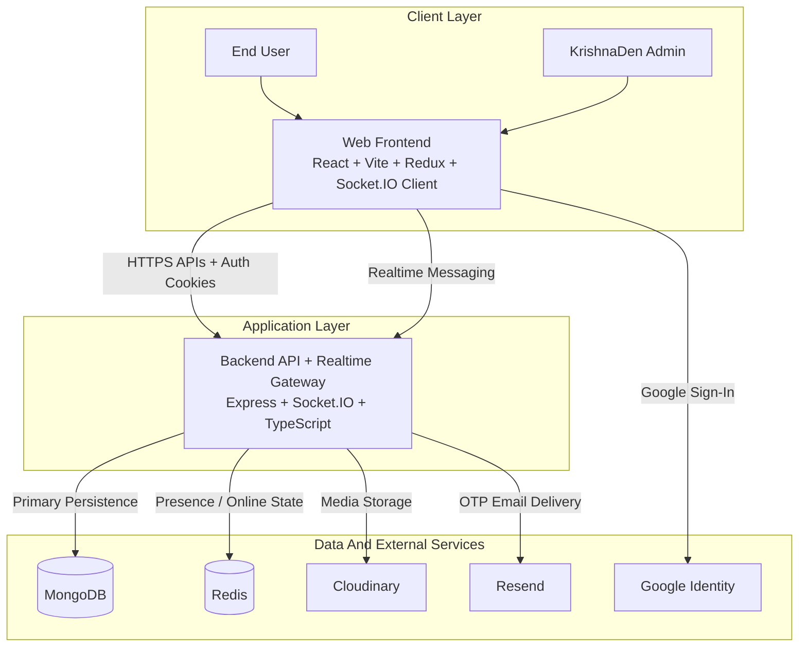

### HLD Summary

The system is split into a browser-based frontend and a real-time backend.

- The frontend handles routing, UI state, authenticated API calls, socket events, and client-side cryptography.
- The backend handles business logic, persistence, real-time fanout, admin operations, OTP flows, and media orchestration.
- MongoDB stores users, chats, requests, and messages.
- Redis tracks online state and supports real-time presence operations.
- Cloudinary stores uploaded media.
- Resend sends OTP emails.
- Google Identity supports Google-based signup and authentication workflows.

## Database Structure

NoviConnect uses MongoDB, so the persistence layer is document-oriented rather than strictly relational. The core collections and references still map cleanly enough to describe with an ER-style view.

### DB Structure Diagram

#### Core Collection
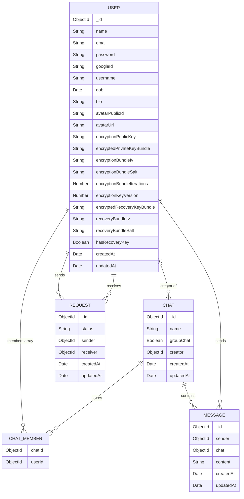

#### Message Subdocuments

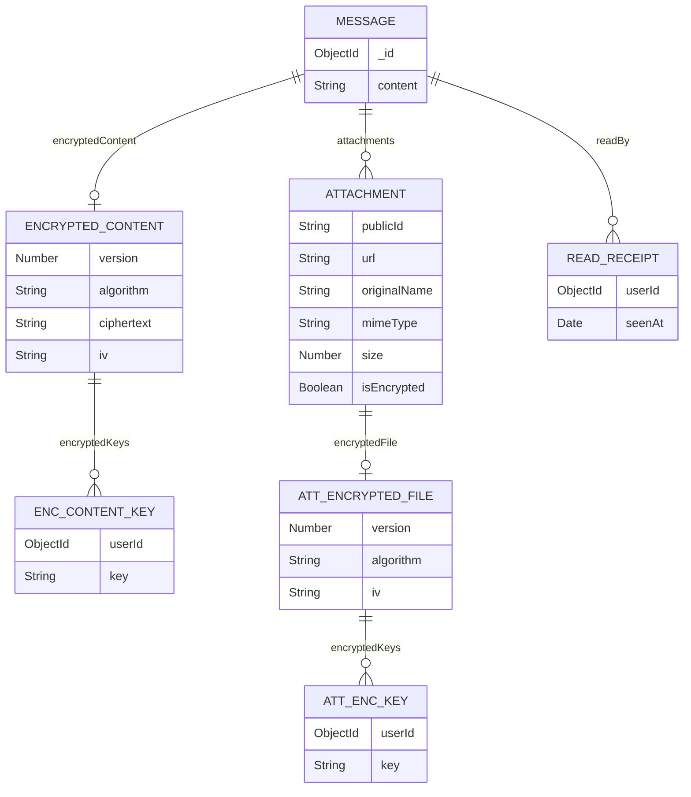

### Schema Notes

- `User` stores identity, profile, auth metadata, and the encrypted key-bundle material needed for E2EE recovery.
- `Chat` stores membership and group metadata. For direct chats, the `members` array effectively defines the conversation pair.
- `Message` stores either legacy plaintext `content` or secure `encryptedContent`, plus attachment metadata and `readBy` entries for unread counts and read receipts.
- `Request` tracks friend-request workflow state between two users.

## Low-Level Design

### Frontend LLD

Core frontend responsibilities are split as follows:

- App bootstrap and route protection:
  - [`new-client/src/App.tsx`](./new-client/src/App.tsx)
  - [`new-client/src/main.tsx`](./new-client/src/main.tsx)
- Global state and API integration:
  - [`new-client/src/redux`](./new-client/src/redux)
- Socket lifecycle and real-time events:
  - [`new-client/src/socket.tsx`](./new-client/src/socket.tsx)
- Chat unread counters, notification badges, and read-receipt rendering:
  - [`new-client/src/components/layout/AppLayout.tsx`](./new-client/src/components/layout/AppLayout.tsx)
  - [`new-client/src/pages/Chat.tsx`](./new-client/src/pages/Chat.tsx)
  - [`new-client/src/components/shared/MessageComponent.tsx`](./new-client/src/components/shared/MessageComponent.tsx)
- E2EE key setup, encryption, decryption, attachment encryption, and recovery:
  - [`new-client/src/lib/e2ee.ts`](./new-client/src/lib/e2ee.ts)
- Public user experience:
  - [`new-client/src/pages`](./new-client/src/pages)
- KrishnaDen admin experience:
  - [`new-client/src/pages/KrishnaDen`](./new-client/src/pages/KrishnaDen)
- Shared UI building blocks:
  - [`new-client/src/components`](./new-client/src/components)

Key route surfaces in the active frontend:

- `/login`
- `/register`
- `/forgot-password`
- `/`
- `/chat/:ChatId`
- `/groups`
- `/settings`
- `/krishnaden`
- `/krishnaden/dashboard`
- `/krishnaden/user-management`
- `/krishnaden/chat-management`

### Backend LLD

Core backend responsibilities are split as follows:

- Server bootstrap, middleware wiring, Socket.IO setup, and route mounting:
  - [`new-server/src/server.ts`](./new-server/src/server.ts)
- User auth, OTP, profile, encryption state, and account management:
  - [`new-server/src/routes/user.routes.ts`](./new-server/src/routes/user.routes.ts)
  - [`new-server/src/controllers/user.controller.ts`](./new-server/src/controllers/user.controller.ts)
- Chat, group, message history, and attachment APIs:
  - [`new-server/src/routes/chat.routes.ts`](./new-server/src/routes/chat.routes.ts)
  - [`new-server/src/controllers/chat.controller.ts`](./new-server/src/controllers/chat.controller.ts)
- Realtime message fanout, unread state initialization, and socket delivery:
  - [`new-server/src/server.ts`](./new-server/src/server.ts)
- KrishnaDen admin operations:
  - [`new-server/src/routes/admin.routes.ts`](./new-server/src/routes/admin.routes.ts)
  - [`new-server/src/controllers/admin.controller.ts`](./new-server/src/controllers/admin.controller.ts)
- Persistence models:
  - [`new-server/src/models`](./new-server/src/models)
- Utility layer:
  - cookies and auth helpers
  - Redis integration
  - Cloudinary integration
  - Resend email helper
  - E2EE rollout config

Important backend route groups:

- user APIs mounted at `/api/v1/user`
- chat APIs mounted at `/api/v1/chat`
- admin APIs mounted at `/admin/api/krishna-den`

### E2EE-Specific LLD

The E2EE subsystem adds an additional architectural slice:

- user documents store:
  - public keys
  - encrypted private-key bundles
  - encrypted recovery-key bundles
- message documents store:
  - ciphertext for secure messages
  - per-recipient wrapped content keys
  - encrypted attachment metadata for secure files
  - per-user read state for unread counts and receipts
- the browser performs:
  - key generation
  - key wrapping
  - encryption
  - decryption
  - recovery-key flows

## Data-Flow Diagrams

### 1. Auth And Session Bootstrap

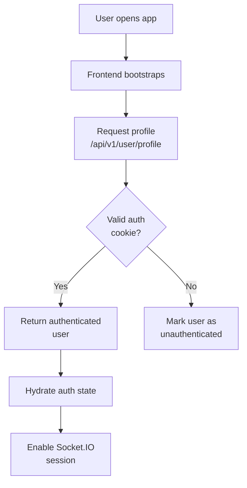

### 2. OTP Signup And Verification Flow

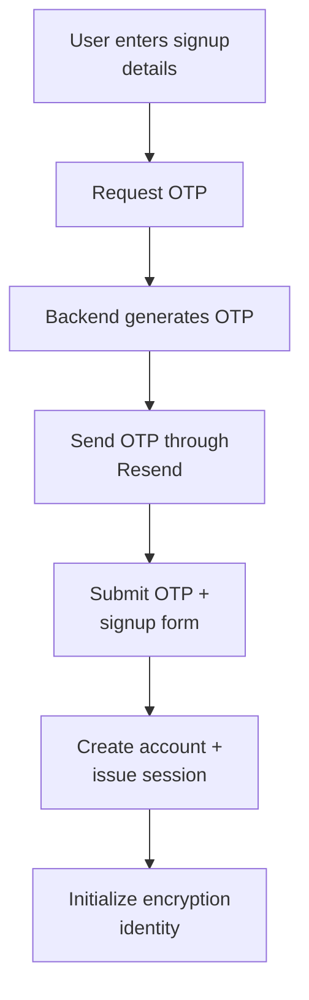

### 3. Secure Message Data Flow

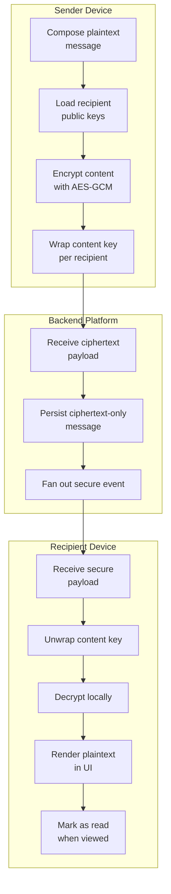

### 5. Offline Unread And Read-Receipt Flow

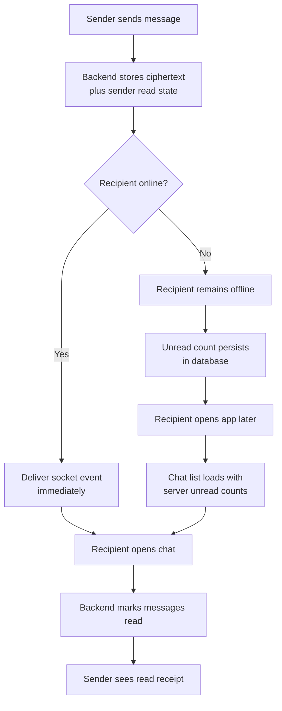

### 4. Secure Attachment Data Flow

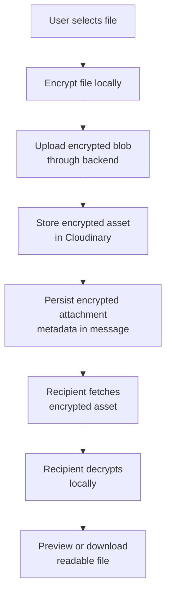

## Sequence Diagrams

### 1. Login And Session Establishment

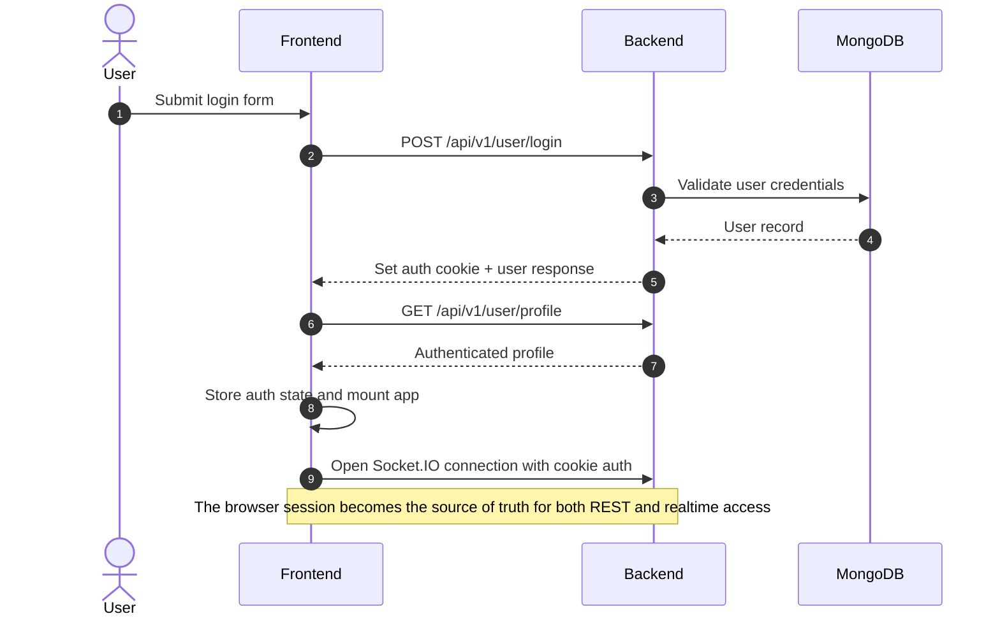

### 2. Signup + OTP + Initial E2EE Setup

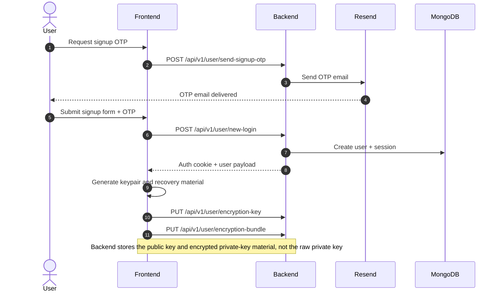

### 3. End-To-End Encrypted Message Send

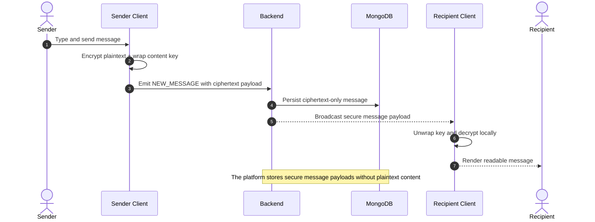

### 5. Unread Recovery And Read Receipt

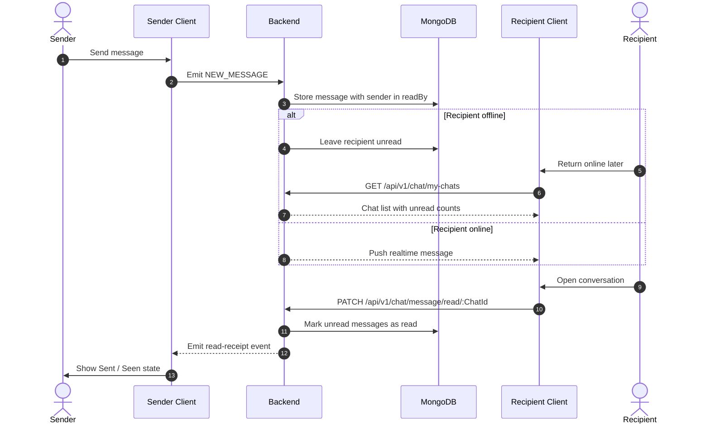

### 4. Forgot Password And E2EE Recovery Tradeoff

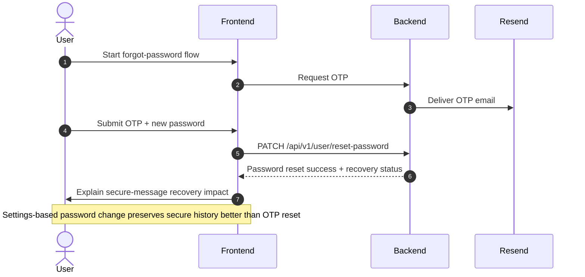

## Security And Privacy Model

### Auth And Session Security

- authenticated APIs rely on cookie-based auth
- cross-domain deployment required explicit CORS allowlists and corrected production cookie behavior
- logout now clears client state and stops protected data fetches and socket activity

### Privacy Model

The legacy system allowed the backend to store and read plaintext message content. The rebuilt system shifts that model:

- secure messages are encrypted client-side
- the backend stores ciphertext for secure flows
- the backend stores public keys and encrypted key bundles, not raw private keys
- attachments can be encrypted before upload
- admin message visibility was removed to stay consistent with the privacy model

### Trust Boundary

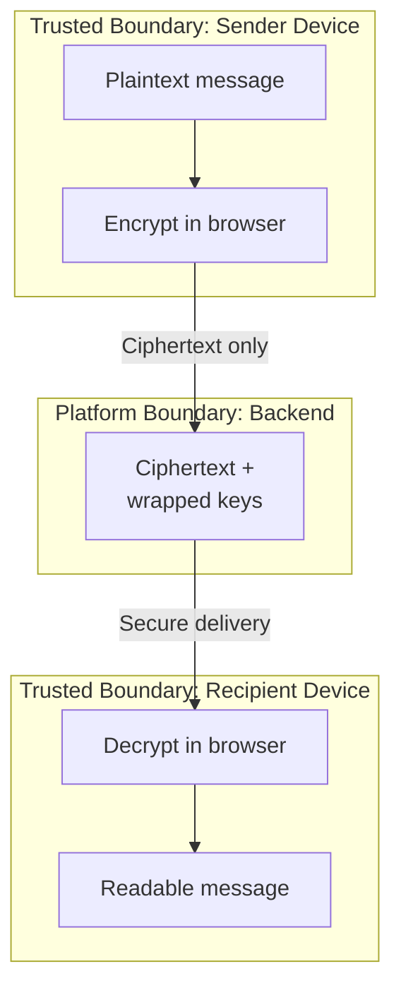

Interpretation:

- sender and recipient devices can see plaintext
- the backend can route and store secure content but should not be able to read it
- this directly supports the requirement that the developer cannot inspect user messages

## Deployment Architecture

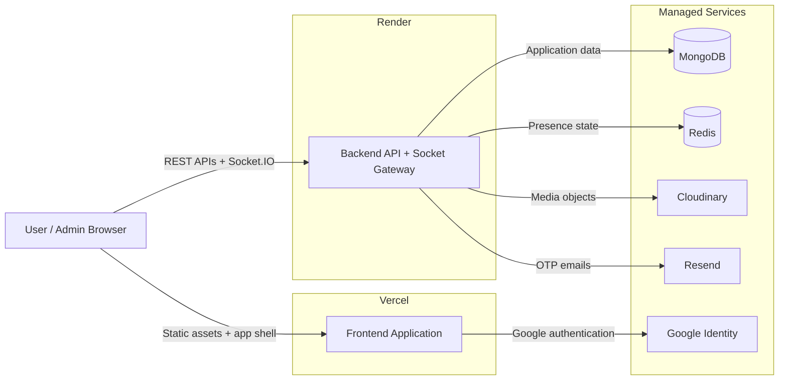

Deployment notes:

- the frontend is designed for Vercel deployment
- the backend is designed for Render deployment
- production cookies and CORS required explicit tuning because the frontend and backend are hosted on different domains
- direct-route handling was added for client-side routes on Vercel

## Testing, Audit, And Verification

The rebuilt system includes explicit verification surfaces that did not exist in the legacy version.

Frontend:

- `npm run build`
- `npm run audit:e2ee`

Backend:

- `npm run build`
- `npm run start`
- `npm run test:e2ee`
- `npm run audit:e2ee`

Verification focus areas include:

- E2EE rollout gating
- secure payload handling
- auth and session behavior
- ciphertext-only persistence for secure message paths
- unread badge recovery after reconnecting from an offline state
- message read-state updates and sender-side receipt rendering
- production-readiness of the TypeScript build flow

## Key Design Decisions And Tradeoffs

### Why Keep Legacy And Modern Code Together?

To show the full migration story, preserve the original baseline, and make it easy to compare design evolution.

### Why Resend Instead Of Consumer SMTP?

Because production OTP delivery needs a more reliable and maintainable provider model than consumer Gmail/SMTP behavior.

### Why Remove Admin Message Visibility?

Because true end-to-end encryption and a privacy-first trust model are incompatible with routine admin access to user message content.

### Why Use Client-Side E2EE?

Because the explicit goal was to ensure that the platform operator and developer cannot read user messages. That requires encryption and decryption to live on user devices.

### Why Add Recovery-Key Flows?

Because E2EE without a recovery strategy creates a poor user experience on new devices. Recovery keys and encrypted key bundles are a compromise between usability and privacy.

## Known Limitations And Honest Boundaries

The project is significantly more capable than the legacy baseline, but the following realities are worth stating directly:

- E2EE introduces more complexity in recovery and multi-device scenarios than a normal chat app
- operational tradeoffs still exist around password reset versus secure-history recovery
- group E2EE using per-message wrapped keys is correct but less optimized than a more advanced sender-key architecture
- the modern implementation is production-oriented, but still positioned as an independent engineering project rather than a large-scale commercial product

## Impact Of The Rebuild

From an engineering perspective, the rebuild demonstrates:

- migration of a working legacy product without discarding its history
- stronger architecture and code quality through TypeScript adoption
- practical debugging of real deployment issues
- full-stack feature ownership from UI through backend through deployment
- applied privacy engineering beyond standard CRUD patterns

From a product perspective, the rebuild delivers:

- more complete auth and recovery flows
- stronger privacy positioning
- improved admin boundaries
- better visual quality and user confidence
- a more realistic platform story than the legacy implementation

## What To Review Next

If you want to dive into the actual implementation, start here:

- frontend overview: [`new-client/README.md`](./new-client/README.md)
- backend overview: [`new-server/README.md`](./new-server/README.md)
- frontend bootstrap: [`new-client/src/App.tsx`](./new-client/src/App.tsx)
- backend bootstrap: [`new-server/src/server.ts`](./new-server/src/server.ts)
- E2EE implementation: [`new-client/src/lib/e2ee.ts`](./new-client/src/lib/e2ee.ts)
- message schema: [`new-server/src/models/message.model.ts`](./new-server/src/models/message.model.ts)
- user encryption schema: [`new-server/src/models/user.model.ts`](./new-server/src/models/user.model.ts)

## Summary

The best way to understand NoviConnect is not as a single chat app snapshot, but as a before-and-after engineering story:

- the legacy system proves the original product foundation
- the modern system proves the ability to redesign, harden, extend, and re-architect that foundation into a much stronger platform

That migration arc is the main value of this repository.
