# Frontend Images

- **Login Page**

  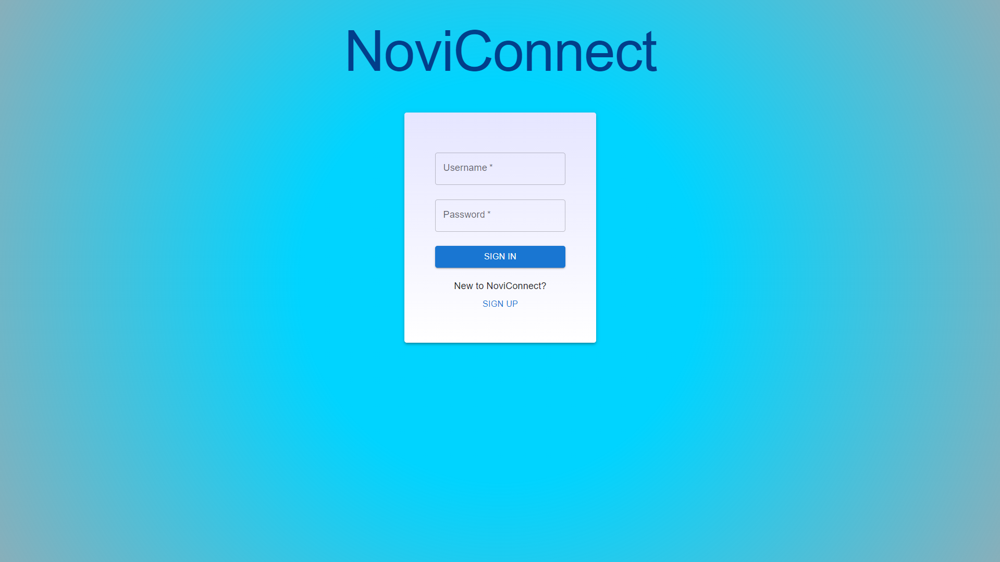

- **Register Page**

    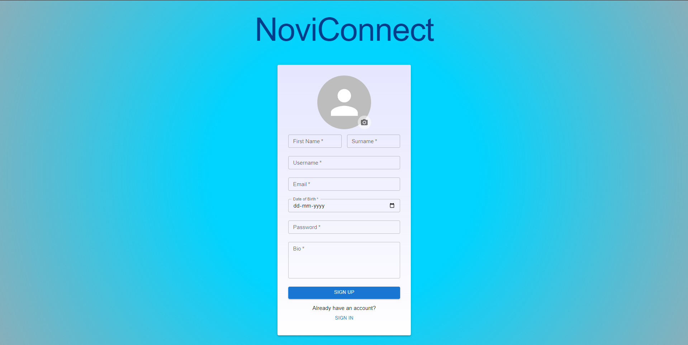

- **Home Page**

    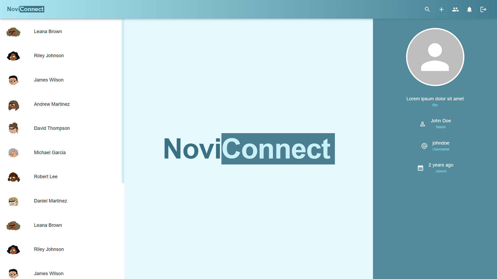

- **Chat Screen**

    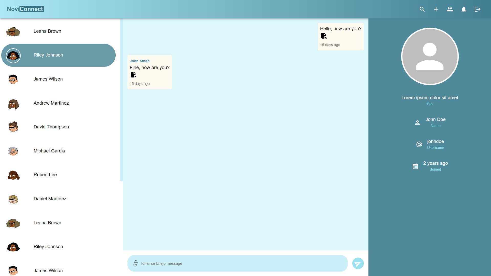

- **Search Dialog**

    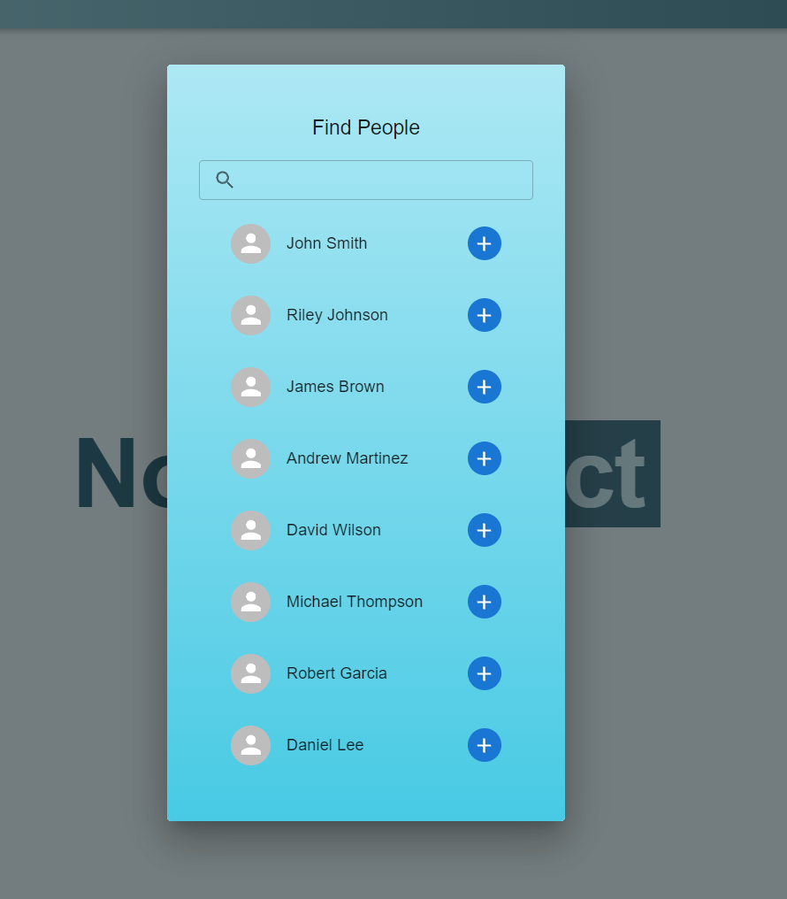

- **Notification Dialog**

    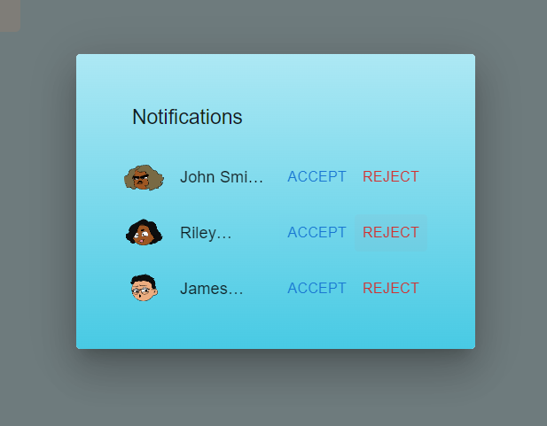

- **New Group Dialog**

    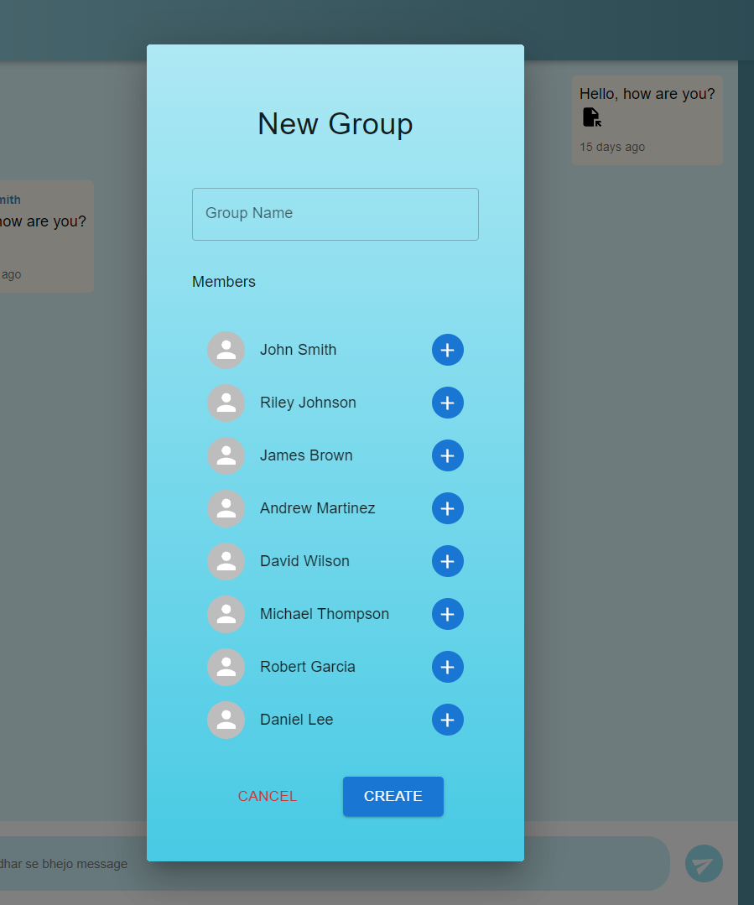

- **Manage Group Screen**

    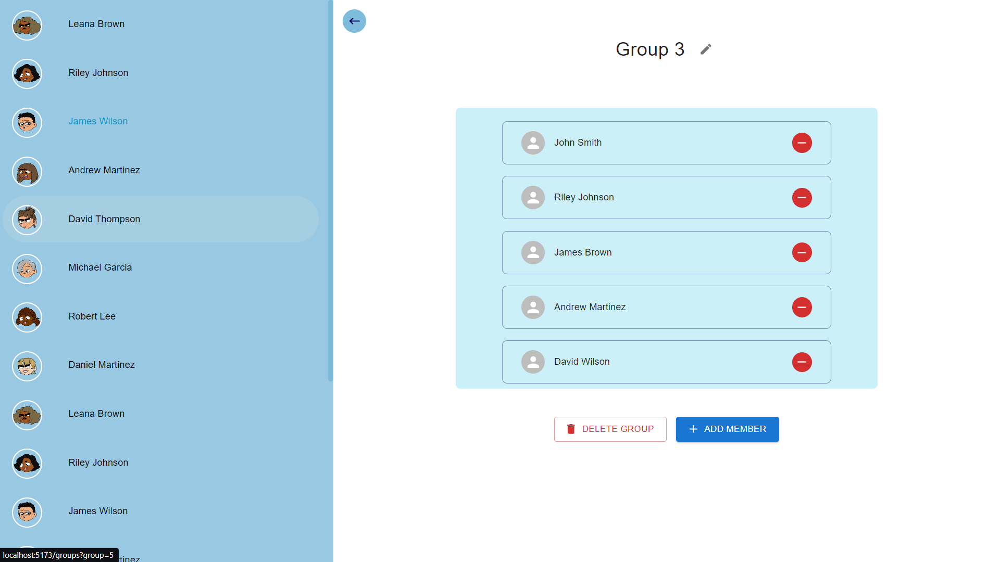
  
- **Admin Login Page**

    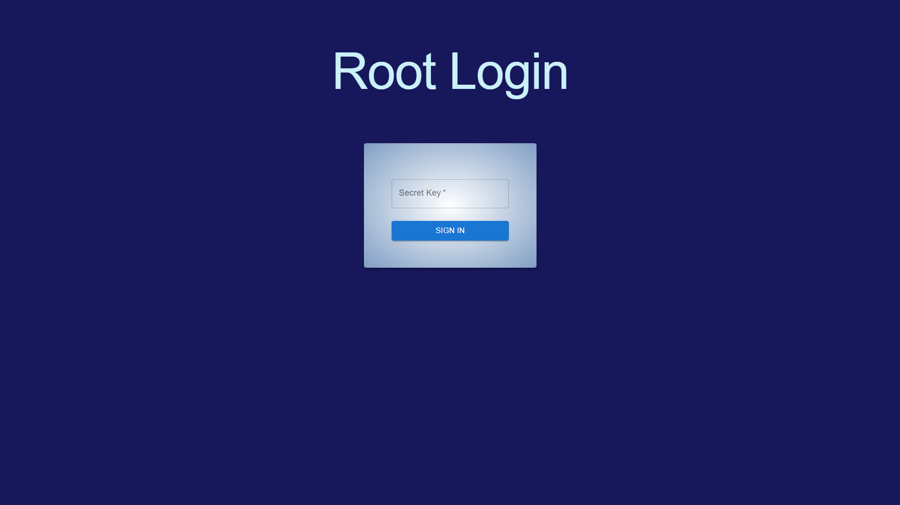
  
- **Admin Dashboard**

    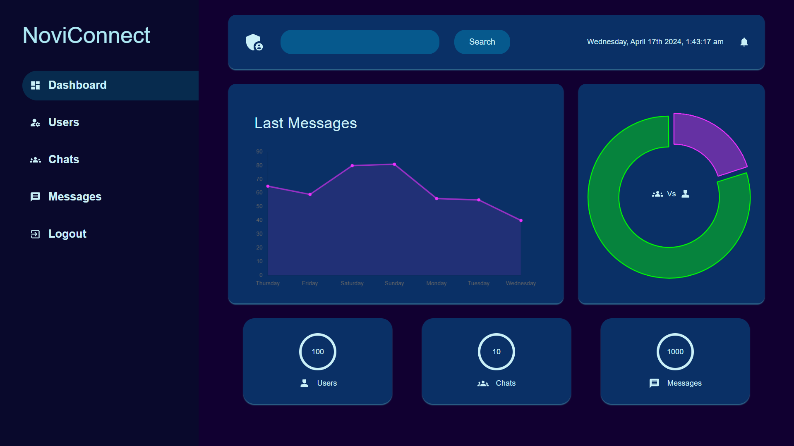

- **Admin Manage Users**
    
    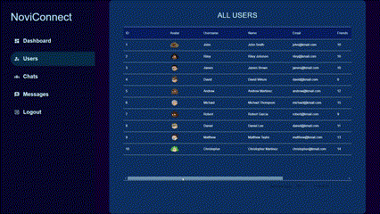

- **Admin Manage Chats**
    
    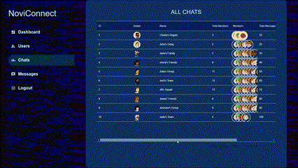

- **Admin Manage Messages**

    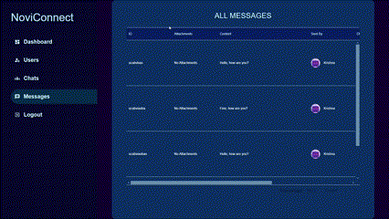

- **Not Found Page**

    