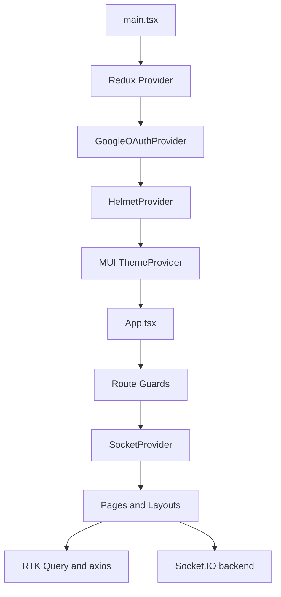
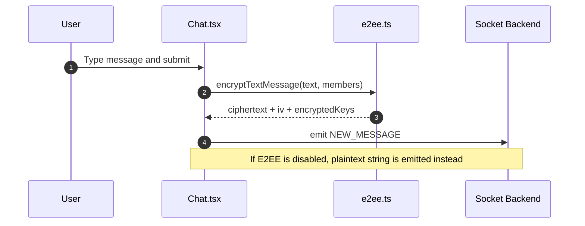

# NoviConnect Frontend

This README is the technical reference for the active frontend in [`noviconnect-client-v2`](https://github.com/009-KumarJi/noviconnect-client-v2). The master README explains the project at a broader level; this document stays focused on implementation detail, design rationale, and a fast way to navigate the code.

## Overview

- This is a React 19 + Vite + TypeScript single-page application for NoviConnect.
- It handles both the user-facing product and the KrishnaDen admin console.
- Authentication is cookie-based and every protected API or socket call depends on backend-issued cookies.
- End-to-end encryption is primarily a frontend responsibility: the browser generates keys, encrypts/decrypts payloads, encrypts attachments, and manages secure identity recovery UX.
- State is split between Redux slices for local UI/session concerns and RTK Query for backend-backed resources.
- Realtime behavior is built on Socket.IO and covers messaging, unread alerts, read receipts, typing indicators, and online presence.

## What This Frontend Owns

- App bootstrap and protected-route gating
- User login, signup, Google-assisted signup, forgot-password, and settings UX
- Chat list rendering, unread counts, mobile/desktop layout behavior, and presence display
- Secure message send/decrypt flows
- Secure attachment encryption, upload, decrypt, and preview/download flows
- Password-backed key-bundle setup and recovery-key workflows
- KrishnaDen admin dashboards and management screens
- Vercel-friendly SPA route handling

## Tech Stack

| Area | Choice | Why It Matters |
|---|---|---|
| Build tooling | Vite 8 | Fast local development and straightforward static deployment |
| UI runtime | React 19 | Modern component model and concurrent-safe foundations |
| Language | TypeScript | Stronger contracts than the legacy JavaScript frontend |
| Routing | React Router 7 | Clear separation of public, protected, and admin routes |
| State | Redux Toolkit + RTK Query | Predictable app state plus cache-aware API access |
| UI library | MUI 7 | Consistent component foundation for both user and admin surfaces |
| Realtime | Socket.IO client | Event-driven messaging and presence |
| Auth integration | `@react-oauth/google` | Google-assisted signup verification |
| Crypto | Web Crypto API | Browser-native E2EE implementation without shipping crypto polyfills |
| Motion/UX | Framer Motion, React Hot Toast | Message animation and operational feedback |

## Runtime Architecture



### Provider tree

The app starts in [`src/main.tsx`](./src/main.tsx):

- Redux `Provider` exposes the global store.
- `GoogleOAuthProvider` enables Google-assisted signup.
- `HelmetProvider` is available for document metadata management.
- MUI `ThemeProvider` and `CssBaseline` establish the base visual system.

### Bootstrap sequence

The first meaningful runtime happens in [`src/App.tsx`](./src/App.tsx):

1. On mount, the app calls `GET /api/v1/user/profile` using `axios` with `withCredentials: true`.
2. `authSlice` is updated with either `userExists` or `userDoesNotExist`.
3. If `VITE_E2EE_ENABLED` is on and a user is available, the app calls `ensureUserEncryptionSetup`.
4. Protected routes are wrapped with `SocketProvider`, so the socket is only mounted for authenticated user flows.
5. Public auth routes and KrishnaDen routes are separated at the router level.

This means the frontend treats the backend cookie as the source of truth for both:

- REST authorization
- socket authorization

## Route Topology

| Route | Access Model | Purpose |
|---|---|---|
| `/login` | public-only | Username/password login |
| `/register` | public-only | OTP or Google-assisted signup |
| `/forgot-password` | public-only | Email OTP based password recovery |
| `/` | authenticated | Home shell inside the chat workspace |
| `/chat/:ChatId` | authenticated | Conversation view with realtime and E2EE logic |
| `/groups` | authenticated | Group management surface |
| `/settings` | authenticated | Profile, email, password, recovery-key, and account lifecycle actions |
| `/krishnaden` | public admin entry | Admin secret-key login |
| `/krishnaden/dashboard` | admin-only | Statistics and dashboard widgets |
| `/krishnaden/user-management` | admin-only | User management |
| `/krishnaden/chat-management` | admin-only | Chat management |

Route protection is implemented through [`src/components/auth/ProtectRoute.tsx`](./src/components/auth/ProtectRoute.tsx) and route composition inside [`src/App.tsx`](./src/App.tsx).

## Directory Map

| Path | Responsibility |
|---|---|
| [`src/App.tsx`](./src/App.tsx) | Top-level route tree, auth bootstrap, encryption bootstrap |
| [`src/main.tsx`](./src/main.tsx) | Provider wiring |
| [`src/socket.tsx`](./src/socket.tsx) | Socket.IO client creation and context |
| [`src/redux/store.ts`](./src/redux/store.ts) | Redux root reducer and middleware |
| [`src/redux/api/apiSlice.ts`](./src/redux/api/apiSlice.ts) | Main user/chat RTK Query API surface |
| [`src/redux/api/adminApiSlice.ts`](./src/redux/api/adminApiSlice.ts) | KrishnaDen admin API surface |
| [`src/redux/reducers`](./src/redux/reducers) | Local slices for auth, chat alerts, and UI misc state |
| [`src/pages`](./src/pages) | User-facing routes |
| [`src/pages/KrishnaDen`](./src/pages/KrishnaDen) | Admin routes |
| [`src/components/layout/AppLayout.tsx`](./src/components/layout/AppLayout.tsx) | Main chat workspace shell, unread sync, presence wiring |
| [`src/pages/Chat.tsx`](./src/pages/Chat.tsx) | Conversation page with send/decrypt/read logic |
| [`src/components/dialogs/FileMenu.tsx`](./src/components/dialogs/FileMenu.tsx) | Attachment selection and secure upload path |
| [`src/components/shared/MessageComponent.tsx`](./src/components/shared/MessageComponent.tsx) | Message rendering, trust-state badges, read receipt label |
| [`src/components/shared/RenderAttachment.tsx`](./src/components/shared/RenderAttachment.tsx) | Attachment decrypt and render logic |
| [`src/lib/e2ee.ts`](./src/lib/e2ee.ts) | Secure identity lifecycle, message encryption, attachment encryption, recovery flows |

## State Management Model

### Redux slices

The Redux store in [`src/redux/store.ts`](./src/redux/store.ts) combines:

- `authSlice`
  - authenticated user object
  - initial auth loading state
  - admin auth state
- `chatSlice`
  - notification count
  - unread alert buckets per chat
  - local persistence of unread alert state
- `miscSlice`
  - transient UI controls like mobile menu, delete menu, and upload loader
- `apiSlice`
  - main RTK Query cache for user/chat data
- `adminApiSlice`
  - admin-only RTK Query cache

### Why both RTK Query and axios exist

The frontend intentionally mixes the two:

- RTK Query is used for cacheable resources and standard mutations such as chats, groups, notifications, and admin queries.
- `axios` is used for:
  - initial auth bootstrap
  - login/signup/password-reset flows
  - multipart profile and avatar updates
  - encryption bundle endpoints
  - one-off settings actions that do not benefit much from RTK Query cache semantics

That split keeps cached data predictable while avoiding awkward ceremony for auth/bootstrap codepaths.

## REST Integration Surface

The main RTK Query endpoints live in [`src/redux/api/apiSlice.ts`](./src/redux/api/apiSlice.ts). The client depends heavily on:

- `myChats`
- `chatDetails`
- `getMessages`
- `markChatAsRead`
- `sendAttachments`
- `searchUser`
- `getNotifications`
- group management mutations

Admin endpoints in [`src/redux/api/adminApiSlice.ts`](./src/redux/api/adminApiSlice.ts) cover:

- dashboard statistics
- all users
- all chats
- user deletion

Every protected request includes `credentials: "include"` or `withCredentials: true`, which is fundamental because the session is cookie-backed rather than token-backed in local storage.

## Realtime Model

Socket creation is isolated in [`src/socket.tsx`](./src/socket.tsx):

```tsx
io(server, { withCredentials: true })
```

That socket is then consumed by layout/page code through React context.

### Event usage

| Event | Consumed In | Purpose |
|---|---|---|
| `ONLINE_USERS` | [`src/components/layout/AppLayout.tsx`](./src/components/layout/AppLayout.tsx) | Presence badges and online-state refresh |
| `GET_ONLINE_USERS` | [`src/components/layout/AppLayout.tsx`](./src/components/layout/AppLayout.tsx) | Explicit request for latest online set after listeners mount |
| `NEW_MESSAGE_ALERT` | [`src/components/layout/AppLayout.tsx`](./src/components/layout/AppLayout.tsx) | Increment unread indicators for chats other than the current one |
| `NEW_REQUEST` | [`src/components/layout/AppLayout.tsx`](./src/components/layout/AppLayout.tsx) | Friend request notification count |
| `REFETCH_CHATS` | [`src/components/layout/AppLayout.tsx`](./src/components/layout/AppLayout.tsx) | Force chat list refresh after structural changes |
| `NEW_MESSAGE` | [`src/pages/Chat.tsx`](./src/pages/Chat.tsx) | Receive message payloads and decrypt when needed |
| `MESSAGE_READ_RECEIPT` | [`src/pages/Chat.tsx`](./src/pages/Chat.tsx) | Merge `readBy` updates into rendered messages |
| `START_TYPING` | [`src/pages/Chat.tsx`](./src/pages/Chat.tsx) | Show typing indicator |
| `STOP_TYPING` | [`src/pages/Chat.tsx`](./src/pages/Chat.tsx) | Hide typing indicator |
| `CHAT_JOINED` / `CHAT_LEFT` | [`src/pages/Chat.tsx`](./src/pages/Chat.tsx) | Presence refresh when a conversation is entered or left |

### Chat shell behavior

[`src/components/layout/AppLayout.tsx`](./src/components/layout/AppLayout.tsx) is the main workspace coordinator:

- loads the user chat list
- reconstructs unread badges from backend `unreadCount`
- persists alert state locally
- keeps mobile and desktop layouts in sync
- requests the latest presence state after listeners are registered

This file is a good indicator that the app is not page-by-page isolated; it behaves more like a coordinated chat shell.

## Message Flow

### Secure message send path



### Message receive path

When a `NEW_MESSAGE` event arrives in [`src/pages/Chat.tsx`](./src/pages/Chat.tsx):

1. The page checks whether the event belongs to the open chat.
2. If secure messaging is enabled, it calls `decryptMessageContent`.
3. The message is appended to local page state.
4. If the message came from another user, the page calls `markChatAsRead`.
5. A later `MESSAGE_READ_RECEIPT` event updates sender-side status from `Sent` to `Seen`.

### Offline unread recovery

Unread recovery is not purely client-side:

- the server computes `unreadCount` in `myChats`
- [`src/components/layout/AppLayout.tsx`](./src/components/layout/AppLayout.tsx) maps that into `chatSlice`
- entering a chat resets local alerts and also calls `PATCH /chat/message/read/:ChatId`

This is a good example of the frontend coordinating local UX with server-side durable state.

## End-to-End Encryption Design

The E2EE implementation lives in [`src/lib/e2ee.ts`](./src/lib/e2ee.ts) and is the most technically distinctive part of the frontend.

### Algorithms and parameters

- asymmetric key exchange and wrapping: `RSA-OAEP`
- RSA modulus length: `2048`
- RSA hash: `SHA-256`
- content encryption: `AES-GCM`
- content key length: `256`
- password/recovery derivation: `PBKDF2`
- PBKDF2 iterations: `250000`

### Secure identity storage model

- local browser storage
  - private key: `localStorage`
  - public key: `localStorage`
- session storage
  - pending recovery key: `sessionStorage`
- backend persistence
  - public key
  - encrypted private-key bundle
  - encrypted recovery-key bundle
  - bundle salts, IVs, and iteration metadata

The trust model is deliberate:

- plaintext and raw private key should only exist on the user device
- the backend stores recovery material only in encrypted form
- the frontend is responsible for key generation, wrapping, unwrapping, encryption, and decryption

### Text message envelope format

Secure text messages are emitted in a shape conceptually equivalent to:

```json
{
  "version": 1,
  "algorithm": "AES-GCM",
  "ciphertext": "base64",
  "iv": "base64",
  "encryptedKeys": [
    {
      "userId": "recipient-or-sender-id",
      "key": "base64-wrapped-content-key"
    }
  ]
}
```

The browser:

1. generates an AES content key
2. encrypts plaintext with AES-GCM
3. wraps the AES key once per chat member using each member's public RSA key
4. emits only ciphertext plus wrapped keys

### Attachment encryption path

Secure attachment upload is handled in [`src/components/dialogs/FileMenu.tsx`](./src/components/dialogs/FileMenu.tsx):

1. user selects files
2. files are encrypted locally with `encryptAttachmentsForUpload`
3. encrypted blobs are renamed with `.enc`
4. `attachmentMetadata` is sent alongside the encrypted files
5. the server stores encrypted objects and metadata
6. [`src/components/shared/RenderAttachment.tsx`](./src/components/shared/RenderAttachment.tsx) later fetches and decrypts blobs on demand

Attachment metadata includes:

- original file name
- MIME type
- original size
- encryption marker
- encrypted file IV
- per-recipient wrapped content keys

### Secure identity lifecycle

`ensureUserEncryptionSetup` supports several states:

- first secure login/signup on a device
  - generate key pair locally
  - create password-wrapped bundle
  - create recovery-key bundle
  - upload both bundles
- returning user on same device
  - load keys from local storage
- returning user on new device with password
  - fetch encrypted bundle from server
  - decrypt locally using password
- returning user on new device without bundle password success
  - prompt for recovery-key restoration through settings

### Recovery-related UX behaviors

The frontend deliberately communicates the security tradeoff:

- settings password change
  - calls backend password change
  - rewraps the secure bundle locally with the new password
  - preserves secure history better
- forgot password flow
  - works through email OTP
  - warns that secure message recovery may be reset for new devices

This distinction is surfaced in:

- [`src/pages/Settings.tsx`](./src/pages/Settings.tsx)
- [`src/pages/ForgotPassword.tsx`](./src/pages/ForgotPassword.tsx)

### Message trust-state rendering

[`src/components/shared/MessageComponent.tsx`](./src/components/shared/MessageComponent.tsx) renders explicit state labels:

- `Encrypted`
- `Legacy`
- `Secure message unavailable`

That is useful for both UX and technical debugging because the app can display mixed-history chats where some messages predate E2EE rollout.

## Auth and Account Lifecycle Flows

### Login

[`src/pages/Login.tsx`](./src/pages/Login.tsx):

- sends username/password to `/api/v1/user/login`
- stores returned user in Redux
- immediately attempts secure identity setup/restoration using the entered password
- warns if a recovery key is required or newly generated

### Signup

[`src/pages/SignUp.tsx`](./src/pages/SignUp.tsx) supports two entry modes:

- email signup with OTP
  - request OTP
  - verify within modal flow
  - submit multipart form including avatar and profile data
- Google-assisted signup
  - verify Google credential with backend
  - prefill profile fields
  - complete registration with backend-validated Google context

After account creation, the frontend immediately provisions the secure identity bundle.

### Forgot password

[`src/pages/ForgotPassword.tsx`](./src/pages/ForgotPassword.tsx) is intentionally a three-step client flow:

1. request OTP
2. verify OTP to receive a reset token
3. submit new password plus reset token

The UI explicitly warns that OTP reset may invalidate secure-history recovery on new devices.

### Settings

[`src/pages/Settings.tsx`](./src/pages/Settings.tsx) is more than profile editing. It is also the operational console for secure identity management:

- update profile and avatar
- change email
- change password and rewrap secure bundle
- restore secure history with recovery key
- regenerate recovery key
- reset encryption state
- delete account

## KrishnaDen Frontend

The admin experience is implemented inside [`src/pages/KrishnaDen`](./src/pages/KrishnaDen):

- separate login surface using a secret key
- separate visual theme in [`src/constants/adminTheme.constant.ts`](./src/constants/adminTheme.constant.ts)
- separate RTK Query slice for admin APIs

Important architectural point:

- admin capabilities focus on user/chat oversight and statistics
- the frontend does not expose an admin message-reading workflow in the active implementation

That aligns with the privacy posture of the rebuilt system.

## Environment Variables

Copy from [`dummy.env`](./dummy.env) and fill actual values:

```env
VITE_SERVER=
VITE_GOOGLE_CLIENT_ID=
VITE_MODE=development
VITE_E2EE_ENABLED=true
```

### Notes

| Variable | Required | Purpose |
|---|---|---|
| `VITE_SERVER` | yes | Backend origin used by RTK Query, axios, and Socket.IO |
| `VITE_GOOGLE_CLIENT_ID` | required for Google signup | Passed into `GoogleOAuthProvider` |
| `VITE_E2EE_ENABLED` | strongly recommended | Feature flag for secure message flows |
| `VITE_MODE` | optional in current code | Present in env template, but not directly consumed by the frontend runtime today |

## Scripts and Verification

```bash
npm run dev
npm run build
npm run lint
npm run preview
npm run audit:e2ee
```

### What `audit:e2ee` checks

[`scripts/e2ee-audit.mjs`](./scripts/e2ee-audit.mjs) is a structural audit rather than a full test suite. It checks for:

- E2EE feature flag usage
- chat encrypt/decrypt wiring
- attachment encryption/decryption wiring
- trust-state rendering labels
- absence of specific plaintext-oriented debug logging patterns

### Honest boundary

The current frontend repo does not include a dedicated unit/integration test suite. Practical verification today is:

- `npm run build`
- `npm run audit:e2ee`
- manual flow testing against the backend

## Deployment Notes

### SPA routing

[`vercel.json`](./vercel.json) rewrites all routes to `index.html`, which is required because the app uses `BrowserRouter` rather than hash-based routing.

### Cross-origin auth requirements

Because the frontend and backend are intended to be deployed on different domains:

- the backend must whitelist the frontend origin in `CLIENT_URLS`
- the backend must set production cookies correctly for cross-site auth
- the frontend must continue sending credentials on protected requests

### Practical deployment split

- frontend: Vercel
- backend: Render

That split is reflected throughout the codebase and is not an afterthought.

## Design Decisions and Tradeoffs

### Why client-side E2EE?

If the goal is "developer and platform operator should not be able to read message plaintext", the browser must own encryption and decryption. That is why the frontend carries more responsibility than a normal CRUD chat UI.

### Why hybrid RTK Query plus axios?

RTK Query is excellent for cacheable chat/admin resources, but auth bootstrap, multipart forms, and encryption bundle flows are simpler with direct `axios` calls. The mixed approach is intentional, not accidental.

### Why local storage for secure identity?

It is a pragmatic device-level persistence mechanism for a browser-only portfolio project. It is not equivalent to hardware-backed secure storage, but it enables a realistic recovery and reconnect experience without native app infrastructure.

### Why per-message wrapped keys instead of sender keys?

The current scheme is easier to reason about and explain:

- each message carries an AES key wrapped per member
- recipients can decrypt independently
- backend stores ciphertext only

The tradeoff is efficiency. A more advanced sender-key architecture would reduce overhead in large groups.

## Recommended Reading Order

If you want to inspect the frontend efficiently:

1. [`src/App.tsx`](./src/App.tsx)
2. [`src/components/layout/AppLayout.tsx`](./src/components/layout/AppLayout.tsx)
3. [`src/pages/Chat.tsx`](./src/pages/Chat.tsx)
4. [`src/lib/e2ee.ts`](./src/lib/e2ee.ts)
5. [`src/components/dialogs/FileMenu.tsx`](./src/components/dialogs/FileMenu.tsx)
6. [`src/components/shared/RenderAttachment.tsx`](./src/components/shared/RenderAttachment.tsx)
7. [`src/pages/Settings.tsx`](./src/pages/Settings.tsx)
8. [`src/redux/api/apiSlice.ts`](./src/redux/api/apiSlice.ts)
9. [`src/pages/KrishnaDen/Dashboard.tsx`](./src/pages/KrishnaDen/Dashboard.tsx)

## Summary

This frontend is not just "a React chat UI". Its main technical value is that it coordinates:

- session bootstrap
- realtime messaging
- unread/read-state UX
- encrypted transport preparation
- encrypted attachment handling
- secure identity recovery
- admin/product separation

That combination is what makes [`noviconnect-client-v2`](https://github.com/009-KumarJi/noviconnect-client-v2) the active, production-oriented frontend rather than a simple redesign of the legacy UI.
