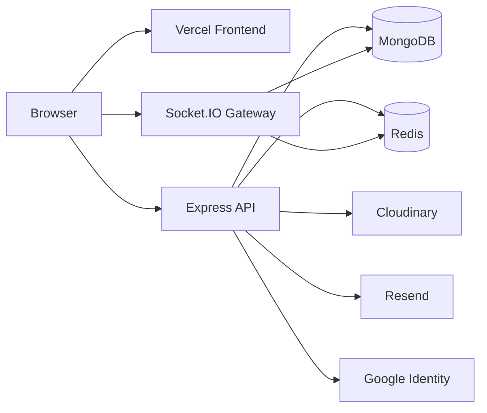
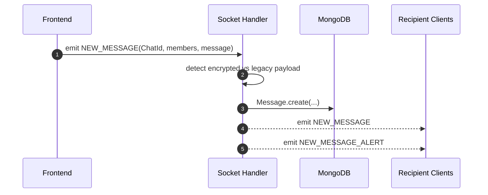

# NoviConnect Backend

This README is the technical reference for the active backend in [`noviconnect-server-v2`](https://github.com/009-KumarJi/noviconnect-server-v2). It focuses on concrete implementation detail: boot sequence, route surface, socket behavior, schema design, security boundaries, and operational tradeoffs.

## Overview

- This service is an Express 5 + TypeScript backend that combines REST APIs and a Socket.IO realtime gateway.
- It owns authentication, cookie issuance, OTP email workflows, Google signup verification, chat and group lifecycle APIs, unread-count computation, attachment storage orchestration, and admin operations.
- MongoDB is the primary data store, Redis supports presence and OTP/reset state, Cloudinary stores media, and Resend delivers transactional email.
- The backend is E2EE-aware but not E2EE-authoritative: it stores encrypted payloads and encrypted key bundles, but it does not generate or decrypt user private keys.
- Cross-origin cookie auth is a first-class concern because the intended deployment split is Vercel frontend plus Render backend.

## Core Responsibilities

- Issue and validate user session cookies
- Issue and validate admin session cookies
- Expose user, chat, group, and admin HTTP APIs
- Maintain a Socket.IO connection layer for realtime messaging and presence
- Persist unread and read-receipt state
- Store ciphertext-only messages when E2EE is enabled
- Store encrypted private-key bundle material and recovery-bundle material
- Orchestrate attachment uploads through Cloudinary
- Send OTP emails through Resend
- Verify Google signup identity tokens

## Stack

| Area | Choice | Why It Matters |
|---|---|---|
| Runtime | Node.js | Standard server runtime for the app |
| Framework | Express 5 | Modern Express foundation with async-friendly routing |
| Language | TypeScript | Safer contracts than the legacy JavaScript backend |
| Database | MongoDB + Mongoose | Good fit for chats, messages, nested attachment metadata, and evolving schemas |
| Realtime | Socket.IO | Persistent bidirectional chat/presence transport |
| Cache/state | Redis via `ioredis` | Online presence plus OTP/reset token storage |
| Media | Cloudinary | Attachment hosting and deletion lifecycle |
| Email | Resend | Production-friendlier OTP email delivery |
| Auth | JWT in httpOnly cookies | Browser-friendly session approach across REST and socket layers |

## Boot Sequence

The entrypoint is [`src/server.ts`](./src/server.ts).

### Startup flow

1. Load environment variables with `dotenv`.
2. Build the CORS allowlist from:
   - `http://localhost:5173`
   - comma-separated `CLIENT_URLS`
3. Connect to MongoDB via `connectDB`.
4. Configure Cloudinary.
5. Create the Express app.
6. Create the HTTP server and attach a Socket.IO server with matching CORS rules.
7. Register JSON, cookie-parser, CORS, and request logging middleware.
8. Mount route groups:
   - `/api/v1/user`
   - `/api/v1/chat`
   - `/admin/api/krishna-den`
9. Attach socket authentication middleware based on the user auth cookie.
10. Start listening on `PORT` or fallback `3000`.

### High-level runtime diagram



## Important Source Files

| Path | Responsibility |
|---|---|
| [`src/server.ts`](./src/server.ts) | Bootstrap, CORS, route mounting, Socket.IO setup |
| [`src/routes/user.routes.ts`](./src/routes/user.routes.ts) | User/auth/account route definitions |
| [`src/routes/chat.routes.ts`](./src/routes/chat.routes.ts) | Chat/group/message route definitions |
| [`src/routes/admin.routes.ts`](./src/routes/admin.routes.ts) | KrishnaDen admin route definitions |
| [`src/controllers/user.controller.ts`](./src/controllers/user.controller.ts) | Signup, login, OTP, settings, encryption bundle, account lifecycle |
| [`src/controllers/chat.controller.ts`](./src/controllers/chat.controller.ts) | Chat list, groups, attachments, messages, read receipts |
| [`src/controllers/admin.controller.ts`](./src/controllers/admin.controller.ts) | Admin stats, user/chat management |
| [`src/models/user.model.ts`](./src/models/user.model.ts) | User and encryption-bundle schema |
| [`src/models/chat.model.ts`](./src/models/chat.model.ts) | Chat/group schema |
| [`src/models/message.model.ts`](./src/models/message.model.ts) | Message, encrypted payload, attachments, read receipt schema |
| [`src/models/request.model.ts`](./src/models/request.model.ts) | Friend request schema |
| [`src/utils/features.ts`](./src/utils/features.ts) | DB connect, cookie options, token issuance, socket event helper, Cloudinary helpers |
| [`src/utils/e2ee-config.ts`](./src/utils/e2ee-config.ts) | E2EE feature flag parsing |
| [`src/middlewares/auth.middleware.ts`](./src/middlewares/auth.middleware.ts) | Cookie-based user/admin/socket auth |

## HTTP API Surface

### User and auth routes

Mounted at `/api/v1/user`.

| Method | Path | Purpose |
|---|---|---|
| `POST` | `/new-login` | Create a new user after OTP or Google preverification |
| `POST` | `/login` | Username/password login |
| `POST` | `/google-signup-verify` | Verify Google credential and issue temporary signup permission in Redis |
| `POST` | `/send-signup-otp` | Send signup OTP to email |
| `POST` | `/forgot-password` | Send password-reset OTP |
| `POST` | `/verify-otp` | Validate OTP and issue temporary reset token in Redis |
| `PATCH` | `/reset-password` | Complete password reset with email + reset token |
| `GET` | `/profile` | Fetch authenticated user profile |
| `PUT` | `/profile` | Update profile and optional avatar |
| `PATCH` | `/email` | Update email address |
| `PATCH` | `/password` | Update password |
| `PUT` | `/encryption-key` | Save or replace public encryption key |
| `GET` | `/encryption-bundle` | Fetch encrypted key-bundle material |
| `PUT` | `/encryption-bundle` | Save encrypted private-key and optional recovery-key bundles |
| `DELETE` | `/encryption-state` | Clear server-side secure identity metadata |
| `DELETE` | `/delete-account` | Permanently delete current account and associated data |
| `GET` | `/logout` | Clear the user auth cookie |
| `GET` | `/search` | Search for users outside existing direct friendships |
| `PUT` | `/send-request` | Create friend request |
| `PUT` | `/accept-request` | Accept or reject friend request |
| `GET` | `/notifications` | Pending incoming friend requests |
| `GET` | `/get-friends` | Direct-chat friends, optionally filtered for group add flows |

### Chat routes

Mounted at `/api/v1/chat`.

| Method | Path | Purpose |
|---|---|---|
| `POST` | `/new-group` | Create group chat |
| `GET` | `/my-chats` | List direct and group chats with unread counts |
| `GET` | `/my/groups` | List only group chats |
| `PUT` | `/addMembers` | Add users to a group chat |
| `PUT` | `/removeMember` | Remove a user from a group chat |
| `DELETE` | `/leave/:ChatId` | Leave a group chat |
| `POST` | `/message` | Upload attachments and create message record |
| `GET` | `/message/:ChatId?page=n` | Paginated message history, 20 messages per page |
| `PATCH` | `/message/read/:ChatId` | Mark unread messages as read and emit read-receipt events |
| `GET` | `/:ChatId` | Chat details, optional populated variant |
| `PUT` | `/:ChatId` | Rename group chat |
| `DELETE` | `/:ChatId` | Delete chat and message history |

### Admin routes

Mounted at `/admin/api/krishna-den`.

| Method | Path | Purpose |
|---|---|---|
| `POST` | `/verify` | Admin secret-key login |
| `GET` | `/logout` | Clear admin cookie |
| `GET` | `/` | Verify admin session |
| `GET` | `/users` | List users with aggregate counts |
| `DELETE` | `/users/:userId` | Delete a user and clean related data |
| `GET` | `/chats` | List chats with creator/member/message aggregates |
| `GET` | `/statistics` | Dashboard counters and 7-day message chart |

Important privacy note:

- there is no mounted admin route for reading message bodies
- the active admin API focuses on operational oversight, not message inspection

That is consistent with the modern privacy posture.

## Authentication and Session Model

### User session cookie

User auth relies on the `nc-token` cookie defined in [`src/constants/config.constant.ts`](./src/constants/config.constant.ts).

The cookie options in [`src/utils/features.ts`](./src/utils/features.ts) are:

- `httpOnly: true`
- `maxAge: 15 days`
- `sameSite: "none"` in production, `"lax"` otherwise
- `secure: true` in production

This is specifically tuned for a frontend and backend hosted on different origins.

### Admin session cookie

Admin auth uses a separate cookie:

- cookie name: `krishna-hero`
- set after `/admin/api/krishna-den/verify`
- also JWT-backed

User and admin sessions are intentionally separated.

### Socket authentication

Socket auth reuses the same user cookie. During socket handshake:

1. cookie-parser is executed against the socket request
2. `socketAuthenticator` reads `nc-token`
3. the token is verified with `JWT_SECRET`
4. the user is loaded from MongoDB
5. `socket.user` is attached for later event handling

This keeps REST and realtime authorization consistent.

## Realtime Architecture

### Room model

On connection, the server joins the socket to a room named by the authenticated user ID:

- room name: `user._id.toString()`

That means event fanout targets user rooms rather than transient socket IDs. `getSockets` in [`src/lib/socketio.helper.ts`](./src/lib/socketio.helper.ts) effectively converts user references into those room names.

### Presence model

Redis stores presence in the `online_users` set:

- connect -> `SADD online_users userId`
- disconnect -> `SREM online_users userId`
- broadcasts -> emit current set to other clients

Redis here is being used for presence state, not as a Socket.IO adapter.

### Realtime event contract

| Event | Produced By | Purpose |
|---|---|---|
| `NEW_MESSAGE` | socket handler in [`src/server.ts`](./src/server.ts) and attachment controller | Deliver message payloads |
| `NEW_MESSAGE_ALERT` | socket handler and attachment controller | Increment unread state for inactive chats |
| `START_TYPING` | socket handler | Typing indicator |
| `STOP_TYPING` | socket handler | Typing indicator reset |
| `ONLINE_USERS` | socket handler | Presence synchronization |
| `GET_ONLINE_USERS` | socket handler | Explicit presence refresh request |
| `CHAT_JOINED` / `CHAT_LEFT` | socket handler | Trigger presence refresh to chat participants |
| `MESSAGE_READ_RECEIPT` | `markChatAsRead` controller | Sender-side read-state update |
| `REFETCH_CHATS` | several controllers | Force clients to reload structural chat state |
| `NEW_REQUEST` | `sendFriendRequest` controller | Notify receiver of a new friend request |
| `ALERT` | group and admin-style informational actions | Human-readable chat status messages |

## Message Lifecycle

### Text message socket flow



### Encrypted vs legacy detection

In [`src/server.ts`](./src/server.ts), the server treats a message as encrypted when:

- `E2EE_ENABLED` is true, and
- the incoming payload is an object containing:
  - `ciphertext`
  - `iv`
  - `encryptedKeys`

Result:

- encrypted path
  - `content` stored as empty string
  - `encryptedContent` stores the payload
- legacy path
  - `content` stores plaintext
  - `encryptedContent` is absent

### Read semantics

When a message is created, `readBy` is seeded with the sender:

```json
{
  "userId": "senderId",
  "seenAt": "timestamp"
}
```

That enables the frontend to label a freshly sent message as `Sent` until another participant reads it.

### Read receipt update flow

`PATCH /api/v1/chat/message/read/:ChatId`:

1. finds unread messages in the chat for the current user
2. pushes the current user into `readBy`
3. emits `MESSAGE_READ_RECEIPT` to the other chat members

### Unread count computation

`GET /api/v1/chat/my-chats` uses a MongoDB aggregation pipeline to compute unread counts per chat by checking:

- sender is not current user
- `readBy` does not already contain current user

This is one of the places where durable server-side state drives frontend UX cleanly.

## Attachment Pipeline

Attachment handling is implemented in [`src/controllers/chat.controller.ts`](./src/controllers/chat.controller.ts).

### Upload flow

1. `multer` receives multipart files.
2. Files are uploaded to Cloudinary via `uploadFilesToCloudinary`.
3. `attachmentMetadata` is optionally parsed from the request body.
4. A `Message` document is created with:
   - attachment URLs and public IDs
   - original name
   - MIME type
   - file size
   - encryption markers and wrapped keys when applicable
5. `NEW_MESSAGE` and `NEW_MESSAGE_ALERT` are emitted.

### Operational constraints

- minimum 1 attachment
- maximum 5 attachments per request

### Encryption-awareness

For encrypted attachments, the backend does not decrypt anything. It only stores:

- encrypted blob URL
- original metadata
- `encryptedFile` metadata containing IV and wrapped keys

## Persistence Model

### `User`

Defined in [`src/models/user.model.ts`](./src/models/user.model.ts).

Stores:

- identity and profile fields
- auth fields such as `password` and optional `googleId`
- avatar metadata
- E2EE public key
- encrypted private-key bundle
- encrypted recovery-key bundle
- IV/salt/iteration metadata
- `hasRecoveryKey`

Notable behavior:

- password hashing occurs in a Mongoose `pre("save")` hook

### `Chat`

Defined in [`src/models/chat.model.ts`](./src/models/chat.model.ts).

Stores:

- `name`
- `groupChat`
- `creator`
- `members[]`

Direct chats are represented as chats with `groupChat: false` and two members.

### `Message`

Defined in [`src/models/message.model.ts`](./src/models/message.model.ts).

Stores:

- sender
- chat
- plaintext `content` for legacy messages
- `encryptedContent` for secure messages
- `attachments[]`
- `readBy[]`

`encryptedContent` includes:

- version
- algorithm
- ciphertext
- IV
- per-user wrapped keys

Attachment subdocuments also support encrypted-file metadata.

### `Request`

Defined in [`src/models/request.model.ts`](./src/models/request.model.ts).

Stores:

- sender
- receiver
- status

Accepting a request creates a direct chat and deletes the request.

## End-to-End Encryption Responsibilities

This backend is E2EE-compatible, but the browser remains the cryptographic endpoint.

### What the backend does

- stores encrypted message payloads
- stores encrypted attachment metadata
- stores public keys
- stores password-wrapped private-key bundles
- stores recovery-key-wrapped bundles
- exposes bundle fetch/save/reset APIs
- gates secure messaging behind `E2EE_ENABLED`

### What the backend does not do

- generate user key pairs
- store raw private keys
- decrypt user message content
- decrypt attachment bytes

### Feature flag

[`src/utils/e2ee-config.ts`](./src/utils/e2ee-config.ts) parses `E2EE_ENABLED` from environment using tolerant truthy parsing:

- `true`
- `1`
- `yes`
- `on`

### Password reset tradeoff

`resetPassword` in [`src/controllers/user.controller.ts`](./src/controllers/user.controller.ts) clears secure bundle state when a reset is done through the OTP path. The API explicitly returns:

- `e2eeRecoveryReset: true` when recovery material existed and had to be cleared

This is an honest security/usability tradeoff, not a hidden behavior.

## Business Logic Details Worth Calling Out

### Group rules

From [`src/controllers/chat.controller.ts`](./src/controllers/chat.controller.ts):

- only the creator can rename, add members, or remove members
- leaving or removing users must preserve minimum group viability
- adding members rejects duplicates
- add flow caps membership at 100
- creator leaving reassigns ownership to a random remaining member

### User deletion cleanup

Both self-delete and admin-delete perform meaningful cleanup:

- delete direct chats involving the user
- delete direct-chat messages
- delete sent messages
- delete friend requests
- remove user from group chats
- reassign group creator if needed
- delete small groups that become invalid
- delete avatar assets from Cloudinary

This is stronger than a naive "delete user row only" implementation.

### Search semantics

`/api/v1/user/search` excludes users already connected through existing direct chats, which keeps the search surface oriented toward new friendships rather than duplicate connections.

## External Services

| Service | Used For | Key Files |
|---|---|---|
| MongoDB | Primary persistence | [`src/models`](./src/models), [`src/utils/features.ts`](./src/utils/features.ts) |
| Redis | OTPs, reset tokens, Google signup verification state, online presence | [`src/utils/redis.ts`](./src/utils/redis.ts), [`src/controllers/user.controller.ts`](./src/controllers/user.controller.ts), [`src/server.ts`](./src/server.ts) |
| Cloudinary | Avatar and attachment storage | [`src/utils/features.ts`](./src/utils/features.ts), [`src/lib/cloudinary.helper.ts`](./src/lib/cloudinary.helper.ts) |
| Resend | OTP delivery | [`src/utils/mail.helper.ts`](./src/utils/mail.helper.ts) |
| Google Identity | Google-assisted signup verification | [`src/controllers/user.controller.ts`](./src/controllers/user.controller.ts) |

## Environment Variables

Start from [`dummy.env`](./dummy.env):

```env
NODE_ENV='DEVELOPMENT or PRODUCTION'
DB_NAME=
MONGO_URI=
PORT=
JWT_SECRET=
ADMIN_SECRET_KEY=
E2EE_ENABLED=true
CLIENT_URLS=
CLOUDINARY_CLOUD_NAME=
CLOUDINARY_API_KEY=
CLOUDINARY_API_SECRET=
RESEND_API_KEY=
RESEND_FROM_EMAIL="NoviConnect <mail@krishna.novitrail.com>"
GOOGLE_CLIENT_ID=
GOOGLE_CLIENT_SECRET=
```

### Additional supported variable

The runtime also supports:

```env
REDIS_URI=redis://127.0.0.1:6379
```

That variable is consumed in [`src/utils/redis.ts`](./src/utils/redis.ts), even though it is not currently listed in `dummy.env`.

### Important notes

| Variable | Purpose |
|---|---|
| `NODE_ENV` | Controls production cookie behavior |
| `CLIENT_URLS` | Comma-separated frontend origins for CORS |
| `JWT_SECRET` | Signs both user and admin JWT cookies |
| `ADMIN_SECRET_KEY` | Used for KrishnaDen login verification |
| `E2EE_ENABLED` | Gates encrypted payload handling |
| `GOOGLE_CLIENT_ID` | Used to verify Google signup ID tokens |
| `GOOGLE_CLIENT_SECRET` | Present in the template, but not directly consumed by the current runtime |
| `RESEND_FROM_EMAIL` | Must match `Name <email@domain.com>` format |

## Local Development

```bash
npm install
npm run dev
```

Production-style build:

```bash
npm run build
npm run start
```

Defaults when env values are omitted:

- `PORT`: `3000`
- `MONGO_URI`: `mongodb://127.0.0.1:27017/noviconnect`
- `REDIS_URI`: `redis://127.0.0.1:6379`

## Scripts and Verification

```bash
npm run dev
npm run build
npm run start
npm run test:e2ee
npm run audit:e2ee
```

### What exists today

- `npm run test:e2ee`
  - currently runs [`src/utils/e2ee-config.test.ts`](./src/utils/e2ee-config.test.ts)
  - validates feature-flag parsing and security-mode interpretation
- `npm run audit:e2ee`
  - runs [`scripts/e2ee-audit.mjs`](./scripts/e2ee-audit.mjs)
  - checks for expected secure-message schema and route wiring

### Honest boundary

This backend does not yet include a broad integration test suite for routes, sockets, or persistence. Current verification is strongest around:

- E2EE feature gating
- schema presence
- route presence
- structural audit of secure-message codepaths

## Deployment Notes

### CORS

Allowed origins are normalized by trimming whitespace and removing trailing slashes. This avoids subtle allowlist mismatches between configured URLs and actual incoming origins.

### Cookies in production

Because frontend and backend are expected to be deployed on different domains:

- `sameSite` must be `none`
- `secure` must be `true`
- frontend requests must include credentials

This is already encoded in `cookieOptions`.

### Platform split

The backend is designed for a standalone Node deployment such as Render, while the frontend is designed for Vercel. The code reflects that operational assumption throughout.

## Recommended Reading Order

If you want the fastest path through the backend:

1. [`src/server.ts`](./src/server.ts)
2. [`src/middlewares/auth.middleware.ts`](./src/middlewares/auth.middleware.ts)
3. [`src/routes/user.routes.ts`](./src/routes/user.routes.ts)
4. [`src/controllers/user.controller.ts`](./src/controllers/user.controller.ts)
5. [`src/routes/chat.routes.ts`](./src/routes/chat.routes.ts)
6. [`src/controllers/chat.controller.ts`](./src/controllers/chat.controller.ts)
7. [`src/models/message.model.ts`](./src/models/message.model.ts)
8. [`src/models/user.model.ts`](./src/models/user.model.ts)
9. [`src/utils/features.ts`](./src/utils/features.ts)
10. [`src/utils/mail.helper.ts`](./src/utils/mail.helper.ts)

## Summary

The strongest technical value of [`noviconnect-server-v2`](https://github.com/009-KumarJi/noviconnect-server-v2) is not that it exposes chat CRUD. It is that the service combines:

- cookie-based auth across HTTP and sockets
- cross-origin deployment-aware configuration
- realtime message fanout
- durable unread and read-receipt state
- media lifecycle management
- OTP and Google-based onboarding/recovery flows
- E2EE-aware persistence without holding raw user secrets

That combination is what makes this backend materially stronger than the original demo-oriented server and a much more complete production-style system.
